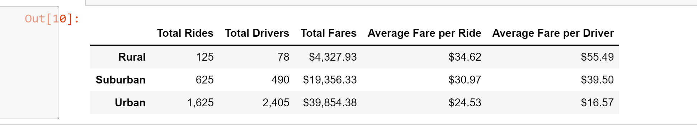
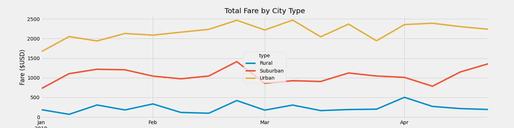

# PyBer_Analysis
# By David Matheny 1/15/2022
# Notes:  Deliverable 2 Instructions are off by 1 step with the juypternotebook provides instructions.  To resolve this I called into the office hours on 1/15/2022.

## Overview of the analysis:
V. Isualize has given myself and Omar a brand-new assignment. Omar passed the buck and now has me doing all the work. I have created a summary DataFrame of the ride-sharing data by city type. Then, I created a  a multiple-line graph that shows the total weekly fares for each city type. 
## Details of Deliverables:

### Deliverable 1
1. Get the total rides for each city type
2. Get the total drivers for each city type
3. Get the total amount of fares for each city type
4. Get the average fare per ride for each city type.
5. Get the average fare per driver for each city type.
6. Create a PyBer summary DataFrame. 
7. Cleaning up the DataFrame. Delete the index name
8. Format the columns.
### Deliverable 2
1. Read the merged DataFrame Note this was off by a step.  I called into office hours to get the instructions for this.  #ride then city, left join = City, ride_data_df and city_data_df 
2. Using groupby() to create a new DataFrame showing the sum of the fares
3. Reset the index on the DataFrame you created in #1. This is needed to use the 'pivot()' function.
4. Create a pivot table with the 'date' as the index, the columns ='type', and values='fare' 
5. Create a new DataFrame from the pivot table DataFrame using loc on the given dates, '2019-01-01':'2019-04-29'.  Remember loc has to be out to the 29 to pick up the 28
6. Set the "date" index to datetime datatype. This is necessary to use the resample() method in Step 8.
7. Check that the datatype for the index is datetime using df.info()
8a. Create a new DataFrame using the "resample()" function by week 'W' and get the sum of the fares for each week.
8b. Using the object-oriented interface method, plot the resample DataFrame using the df.plot() function.

## Results:
### Deliverable 1 result (see below)

### Deliverable 2 result (see below)

## Summary: 
Based on the results above we can see population is the driving(no pun intended) factor.  Urban areas have the most people hence the most total rides.  Since it has the most rides its got the most demand and competition, which is more than likely driving down the that the average fare per ride(see chart 1 above).  On the the other end of things you have Rural areas which have less people and less demand.  This lack of demand means less competition, hence the prices higher.  I would recommend to PyBer to not change its current business structure, leave the free market alone.  Trying to force more ride shares in Rural areas clearly is not what the market wants.  Rural areas dont want ride shares if they did there would be more total rides(see chart 1 above).  Rideshares make sense in a city not a rural area, the same with pickup trucks make sense in a rural area and not in a city.
